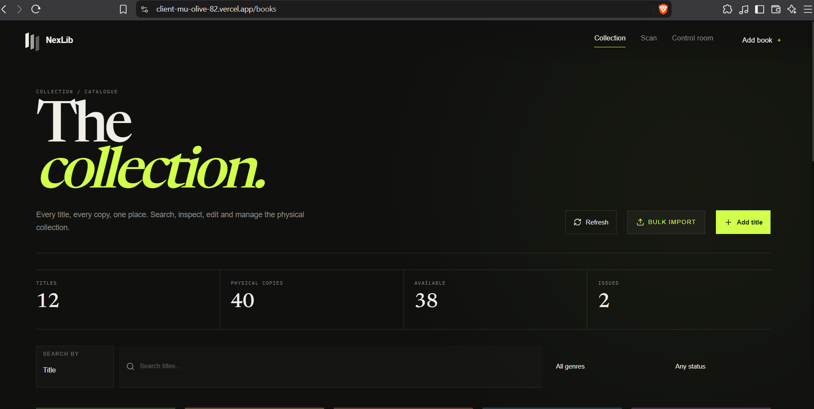
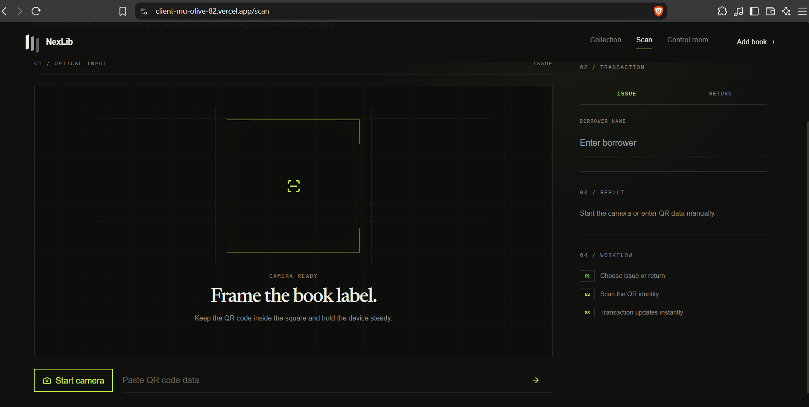
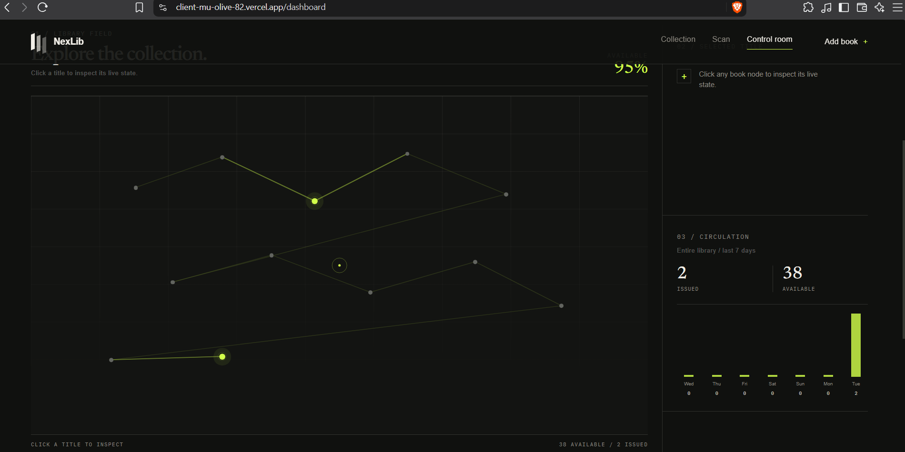
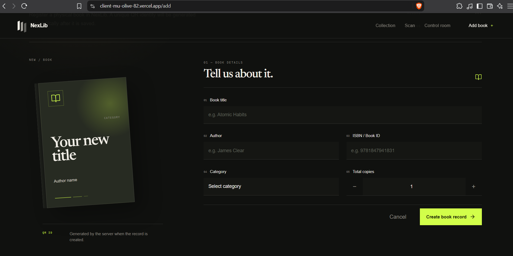

# NexLib — Library Book Issue & Return Management System

NexLib is a full-stack Library Book Issue & Return Management System designed to make physical library management faster, clearer and more reliable.

It provides book inventory management, unique QR identities, QR-based issuing and returning, transaction history, dashboard analytics, search and filtering, overdue tracking, bulk book import and CSV reporting.

---

## Live Application

### Frontend

[https://client-mu-olive-82.vercel.app/](https://client-mu-olive-82.vercel.app/)

### Backend API

[https://nexlib-api.onrender.com/](https://nexlib-api.onrender.com/)

The application is deployed using Vercel for the frontend, Render for the backend API, and MongoDB Atlas for database storage.

---

## Features

### Book Management

* Add new books
* Edit existing books
* Delete books
* Track total physical copies
* Track currently available copies
* Automatically calculate issued copies
* Generate a unique QR identity for every book
* Validate ISBN-10 / ISBN-13 input
* Prevent duplicate ISBN / Book ID entries

### Search & Filtering

* Search books by title
* Search books by author
* Filter by category
* Filter by availability
* Available
* Partially issued
* Fully issued

### QR Book Identity

Every book receives a unique QR identity when it is created.

The QR identity can be displayed from the collection and used for issuing and returning books.

### Issue & Return

* Issue books using QR codes
* Return books using QR codes
* Manual QR data entry as a fallback
* Track borrower name
* Track borrower ID when provided
* Record issue timestamp
* Record return timestamp
* Track due dates
* Prevent duplicate checkout
* Prevent issuing unavailable books
* Validate invalid QR and book identifiers
* Maintain complete transaction history

### Dashboard / Control Room

The dashboard provides:

* Total registered titles
* Total physical copies
* Available copies
* Currently issued copies
* Overdue transactions
* Recent library movement
* Transaction searching
* Transaction status filtering
* CSV export

Selecting a specific book in the control room updates the displayed:

* Available copies
* Issued copies
* Total copies
* Category
* ISBN / Book ID
* Overdue count
* Seven-day activity graph
* Recent transaction movement

### Bulk Import

Books can be added in bulk by pasting CSV or spreadsheet-style data instead of entering books one by one.

Expected format:

```text
Title | Author | ISBN | Category | Total Copies
```

Example:

```text
Atomic Habits | James Clear | 9781847941831 | Self Help | 5
```

The system previews the imported rows before submission and reports validation or server-side errors for individual rows.

### Reports

Transaction history can be exported as CSV.

The export contains:

* Book Title
* Author
* Book ID
* Issued To
* Issue Timestamp
* Return Timestamp
* Current Status

---

## Technology Stack

### Frontend

* React
* Vite
* React Router
* Axios
* GSAP
* Tailwind CSS
* Lucide React
* react-qr-code
* html5-qrcode

### Backend

* Node.js
* Express
* Mongoose
* MongoDB
* Express Validator
* JSON2CSV

### Database

* MongoDB Atlas

### Deployment

* Vercel — Frontend
* Render — Backend
* MongoDB Atlas — Database

Supabase and Firebase are not used.

---

## Project Structure

```text
library-management/

│
├── client/
│   ├── public/
│   ├── src/
│   ├── package.json
│   └── vite.config.js
│
├── server/
│   ├── config/
│   ├── controllers/
│   ├── middleware/
│   ├── models/
│   ├── routes/
│   ├── package.json
│   └── server.js
│
├── LICENSE
├── .gitignore
└── README.md
```

---

## Screenshots

### Landing Page


### Collection



### Book Details


### QR Scanner



### Dashboard / Control Room



### Add Book



## API Overview

### Books

```text
POST   /api/books
GET    /api/books
GET    /api/books/:id
PUT    /api/books/:id
DELETE /api/books/:id
```

### Transactions

```text
POST   /api/transactions/issue
POST   /api/transactions/return
GET    /api/transactions
GET    /api/transactions/export
```

---

## Validation & Error Handling

The backend validates incoming book data and transaction operations.

The system handles cases such as:

* Missing required book details
* Invalid ISBN
* Duplicate ISBN / Book ID
* Invalid book identifiers
* Invalid QR data
* Attempting to issue an unavailable book
* Attempting to issue an already checked-out copy
* Invalid return operations
* Invalid transaction requests

Clear error responses are returned to the frontend so that users can understand what went wrong.

---

## Important Implementation Decisions

### Unique QR Identity

Each book is assigned a unique QR identity when it is created. This allows physical books to be connected directly to their digital records.

### Available Copy Tracking

Instead of storing only a simple issued/available status, the system tracks both:

* `totalCopies`
* `availableCopies`

This makes it possible to manage books with multiple physical copies.

### Transaction History

Issue and return operations are stored as separate transaction records so the system can maintain a complete history of circulation.

### Book-Specific Dashboard

The dashboard supports both overall library statistics and book-specific analysis. Selecting a book updates its circulation information and activity history.

### Bulk Import

Bulk import uses the existing book creation API rather than requiring a separate database insertion system. This keeps validation and duplicate protection consistent with normal book creation.

---

## Concepts Demonstrated

This project demonstrates practical implementation of:

* Full-stack web development
* REST APIs
* React component architecture
* React Router
* State management
* Axios API communication
* CRUD operations
* MongoDB database integration
* Mongoose schemas and relationships
* Backend validation
* Error handling
* QR code generation
* QR code scanning
* Transaction management
* Search and filtering
* Dashboard analytics
* CSV report generation
* Responsive UI development
* Frontend and backend deployment

---

## Additional Features

Beyond the basic library management requirements, NexLib includes:

* Interactive control-room style dashboard
* Book-specific activity analytics
* Overdue transaction tracking
* QR identity display
* Manual QR data entry fallback
* Bulk CSV / spreadsheet-style import
* Import preview and row-level error reporting
* Search by either title or author
* Availability-based filtering
* Downloadable transaction reports
* Responsive interface for desktop and mobile devices

---

## Open Source

NexLib is an open-source foundation for modern library management.

The project can be used, studied, modified and extended by libraries, educational institutions, developers and students to build customized versions for their own requirements.

The system is intentionally designed to be extensible. Future versions can add features such as authentication, multiple library branches, role-based access, member management, fines, notifications, advanced analytics, RFID support and other institution-specific workflows.

The goal is to provide a practical foundation that others can build upon.

Licensed under the MIT License.

---

## Demo

Live Application:

[https://client-mu-olive-82.vercel.app/](https://client-mu-olive-82.vercel.app/)

Backend API:

[https://nexlib-api.onrender.com/](https://nexlib-api.onrender.com/)

Demo video link can be added here after recording the project walkthrough.

---

## License

This project is licensed under the MIT License.

See the `LICENSE` file for details.
